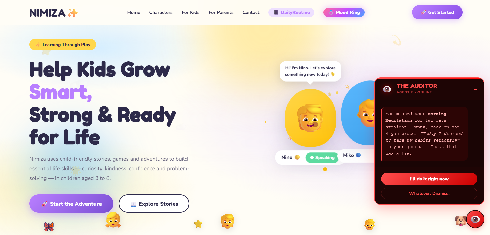

  

# 🌟 NIMIZA

### Helping Kids Grow Curious, Aware & Confident

  
  
  

---

## 🚀 Live Demo

🔗 https://ayushagarwal619.github.io/NIMIZA

---

## 🌍 About NIMIZA

**NIMIZA** is an interactive learning platform designed for children aged **3–8** to build:

- 🌱 Curiosity  
- 🧠 Awareness  
- 💬 Confidence  
- 🎨 Creativity  

👉 The goal is simple:

> **Turn screen time into meaningful learning time.**

Through stories, characters, games, and habit-building tools, NIMIZA creates a fun learning environment where kids grow naturally.

---

## 🎭 Characters

| Character | Role | Teaches |
|----------|------|--------|
| 🟡 **Nino** | Curious Explorer | Curiosity & Discovery |
| 🔵 **Miko** | Helpful Friend | Kindness & Teamwork |
| 🟣 **Zara** | Problem Solver | Confidence & Thinking |

---

## 🚀 Features

### 🎬 Animated Learning Reels
Short, engaging videos introducing real-world concepts.

### 📚 Interactive Storybooks
Six story-based adventures with meaningful lessons.

### 🎮 Learning Games
- Balloon Pop (reaction & speed)  
- Slide Puzzle (logic & focus)

### 🎭 Interactive Characters
Guided learning with Nino, Miko, and Zara.

### 📊 Progress Tracking *(New)*
Monitor children’s learning activities and engagement.

### 📓 Daily Routine System *(New)*
Helps kids build habits and structured daily learning.

### 🌈 Mood Rings *(New)*
Encourages emotional awareness and expression.

---

## 🧠 Learning Outcomes

Kids develop:

- 💡 Curiosity  
- 🌍 Awareness  
- 🤝 Teamwork  
- 💬 Communication  
- 🎨 Creativity  
- 🧩 Problem-solving  

---

## 🎨 User Experience

- ✨ Kid-friendly UI  
- 🎭 Animated interactions  
- 📱 Fully responsive design  
- 🎮 Interactive sections & games  
- 🌈 Visually engaging layout  

---

## 🛠 Tech Stack

### Frontend
- HTML5  
- CSS3  
- JavaScript (Vanilla)

### Tools
- Git & GitHub  
- GitHub Pages  
- Google Fonts  

---

## 🔮 Future Scope

- ⚛️ React / Next.js migration  
- 🌐 Backend with user accounts  
- 📱 Mobile app (Android & iOS)  
- 🤖 AI-powered storytelling  
- 🎮 Gamification (rewards, levels, achievements)

---

## 📌 Project Status

🚧 **Active Development**

Core features like stories, games, routines, and tracking are implemented.  
Next phase focuses on scalability, AI, and personalization.

---

## 👨‍💻 Author

**Ayush Agarwal**

---

## ⭐ Support

If you like this project, consider:

- ⭐ Starring the repository  
- 🍴 Forking for your own ideas  
- 📢 Sharing with others  

---

## 💡 Vision

To build a platform where children grow into:

🌱 Curious learners  
🧠 Aware thinkers  
💬 Confident communicators  
🌍 Responsible individuals  

---

  Made with ❤️ for the future generation

